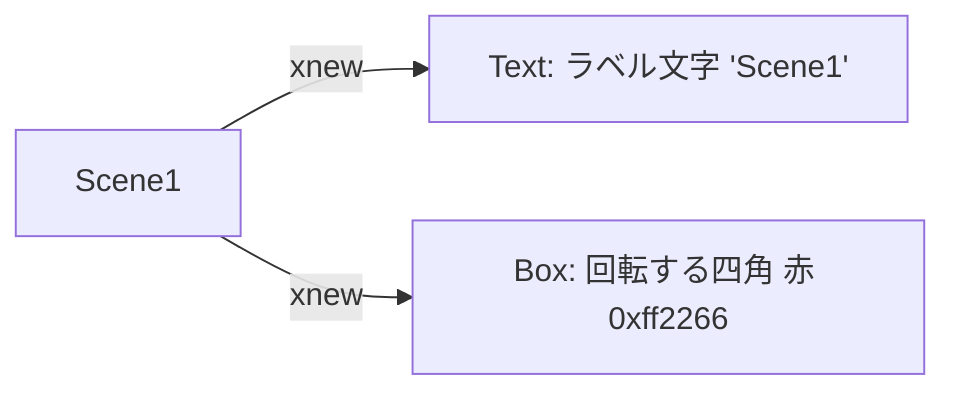

# pixi_scenechange — 構造図

対象: [`script.js`](./script.js)

---

# Scene1

## シーン内の構造

## シーン遷移の条件

画面を `pointerdown`（タップ／クリック）すると `Scene2` へ遷移する。

---

# Scene2

## シーン内の構造

## シーン遷移の条件

画面を `pointerdown`（タップ／クリック）すると `Scene1` へ遷移する。
