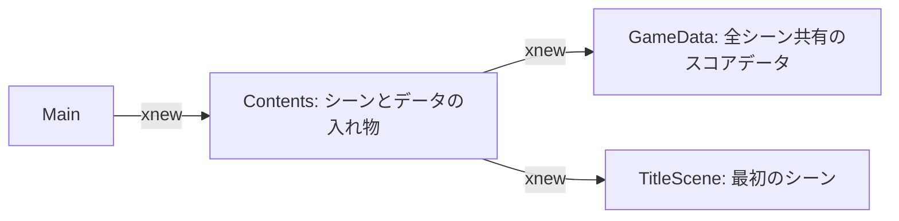
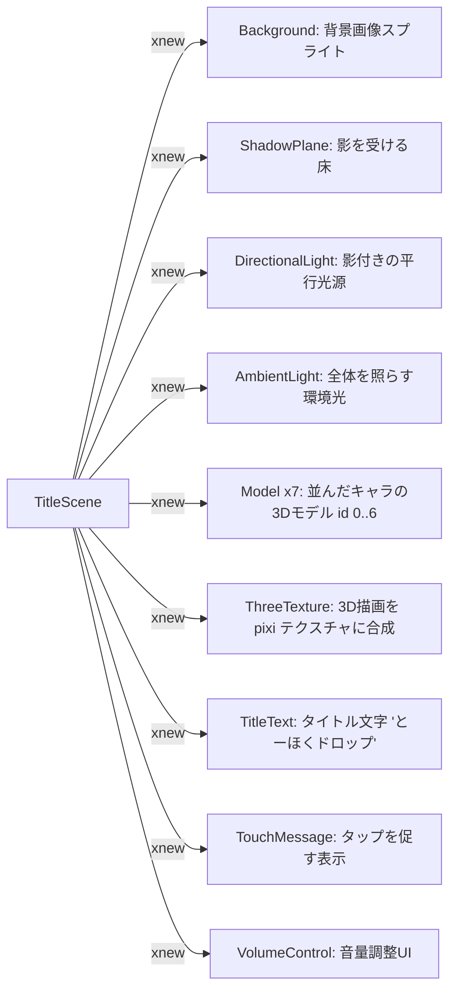
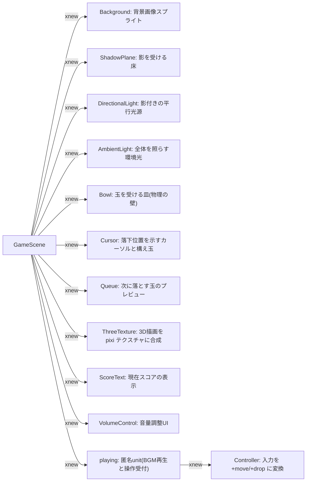
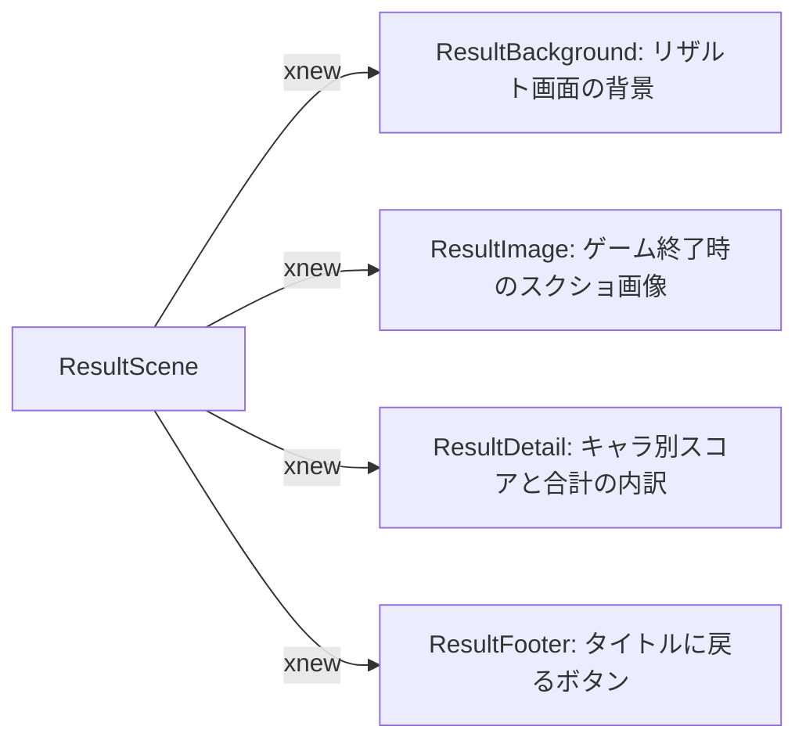
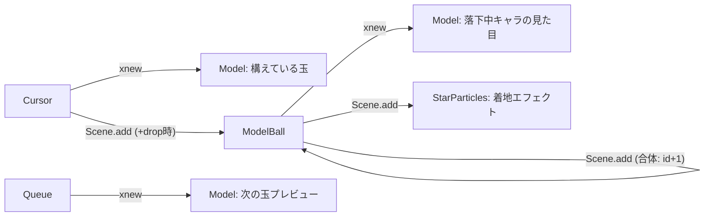

# tohoku_drop — 構造図

対象: [`script.js`](./script.js)

東北キャラのボクセルモデルを落として同じ種類を合体させ、スコアを競うスイカゲーム風アプリ。
Three.js（3Dモデル）を OffscreenCanvas に描画し、それを PixiJS のテクスチャに重ねて表示、
物理は matter-js で計算する（addon: xthree / xpixi / xmatter）。

---

## 全体構成

`Main` は描画パイプライン（three → pixi）と画面（`Screen`）を用意するだけ。
`Contents` が `GameData`（全シーンで共有するスコアデータ）と最初のシーン `TitleScene` を持つ。
以降、シーンは `TitleScene → GameScene → ResultScene → TitleScene …` と入れ替わる。

---

# TitleScene

## シーン内の構造

## シーン遷移の条件

画面を `pointerdown`（タップ／クリック）すると `GameScene` へ遷移する。

---

# GameScene

## シーン内の構造

## シーン遷移の条件

ボールが画面下まで落ちると `+gameover` イベントが発火し、`playing` を finalize して
スコア画像を撮影。約 2 秒後（`xnew.timeout`）に `ResultScene` へ遷移する（撮影画像を渡す）。

---

# ResultScene

## シーン内の構造

## シーン遷移の条件

`ResultFooter` の戻るボタン（`onBack`）を押すと `TitleScene` へ戻る。

---

# ゲームプレイの主要コンポーネント

GameScene の遊びの中核は、`Cursor`・`Queue`・`ModelBall` が動的に `Model` や玉を
生成し合う部分にある。これらはイベント（`+drop` / `+reload` / `+gameover` 等）で連携する。

- `Cursor` は `+drop` で `ModelBall` をシーンに追加し、`+reload` を発火して次の玉へ。
- `ModelBall` は `Circle`（matter-js の物理ボディ）を `extend` しており、同じ id 同士が接触すると
  両者を finalize し、`id+1` の `ModelBall` を生成する（合体）。落下しきると `+gameover` を発火。
- `Model` は voxelkit → VRM で読み込んだ 3D キャラ。Three.js 側に毎フレームアニメーションを与える。
